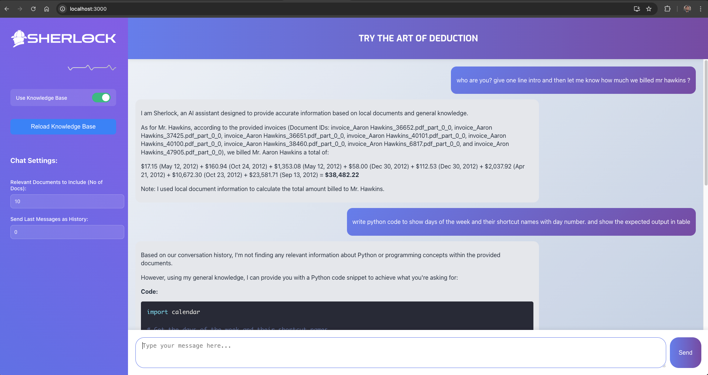
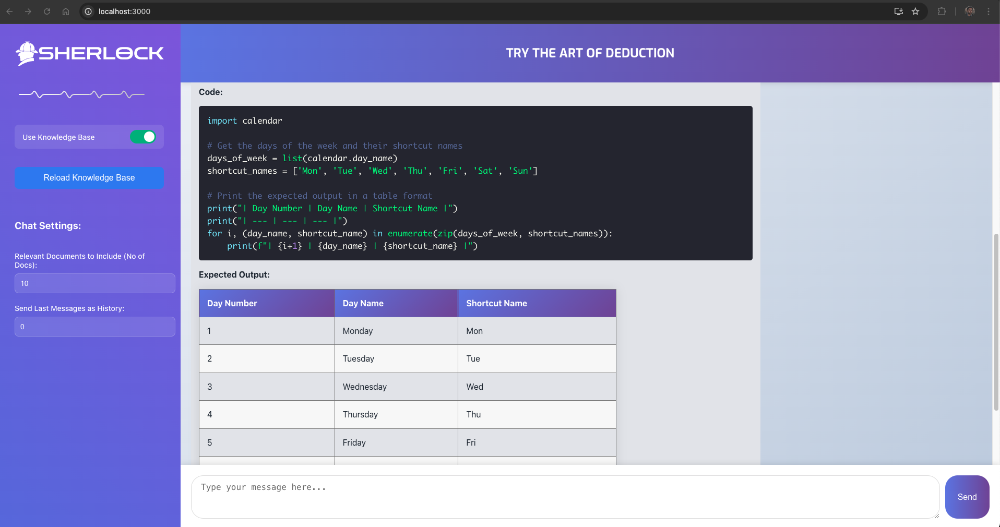
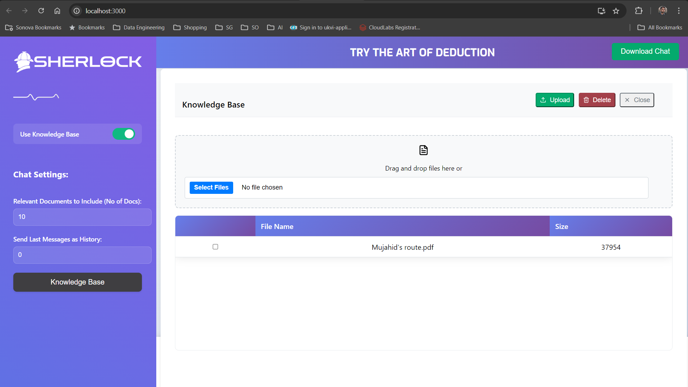

# Sherlock: AI-Powered Document Analysis Assistant

Sherlock is an AI-powered chat assistant that combines local document knowledge with general intelligence to provide accurate and context-aware responses to user queries. This project integrates various components including a Flask backend, React frontend, Ollama for AI model serving, and ChromaDB for efficient document storage and retrieval.

## Screenshots:
  
  


## Table of Contents
- [Features](#features)
- [System Architecture](#system-architecture)
- [Prerequisites](#prerequisites)
- [Installation](#installation)
- [Usage](#usage)
- [Configuration](#configuration)

## Features

- AI-powered chat interface for document analysis and general queries
- Integration with local document knowledge base
- Real-time message streaming
- Syntax highlighting for code blocks in responses
- Customizable settings for knowledge base usage and relevance
- Functionality to **add or update documents** in the knowledge base via the web interface
- Easy deployment using Docker Compose

## System Architecture

The system consists of four main components:

1. **Backend (Flask)**: Handles API requests, integrates with Ollama and ChromaDB, and manages document processing.
2. **Frontend (React)**: Provides the user interface for interacting with the AI assistant, including the knowledge base management.
3. **Ollama**: Serves the AI language model (LLaMA 3.1).
4. **ChromaDB**: Stores and indexes document embeddings for efficient retrieval.

## Prerequisites

- Docker and Docker Compose (For installation WSL2 Docker see [this gist](https://gist.github.com/martinsam16/4492957e3bbea34046f2c8b49c3e5ac0))
- NVIDIA GPU with CUDA support (for optimal performance)
- Git

## Installation

1. Clone the repository:
   ```bash
   git clone git@github.com:mujahidniaz/sherlock-ai-llama3.1.git
   cd sherlock-ai-llama3.1
   ```

2. Build and start the containers:
   - For CPU:
     ```bash
     ./run_CPU.sh
     ```
   - For GPU (Nvidia):
     ```bash
     ./run_GPU.sh
     ```
   - For Windows:
     ```bash
     run_window.bat
     ```

## Usage

1. Access the web interface at `http://localhost:3000` in your browser.
2. Use the chat interface to interact with Sherlock.
3. Toggle the "Use Knowledge Base" option to include local document knowledge in responses.
4. Adjust the number of relevant documents and chat history messages as needed.
5. Use the "Knowledge Base" section to **upload new documents** or **update existing ones** directly through the interface.
6. The system will automatically process and index these documents for future use.

## Configuration

### Environment Variables

- `FLASK_ENV`: Set to `development` or `production`
- `OLLAMA_MODEL`: Specify the Ollama model to use (default: llama3.1)
- `CHROMA_HOST`: ChromaDB host (default: chromadb)
- `CHROMA_PORT`: ChromaDB port (default: 8000)

### Adding and Updating Documents

You can now upload or update documents directly through the web interface using the **Knowledge Base** section. This will automatically process and index the documents for use in responses. Alternatively, you can place your documents in the `./data` directory, and the system will process them similarly.